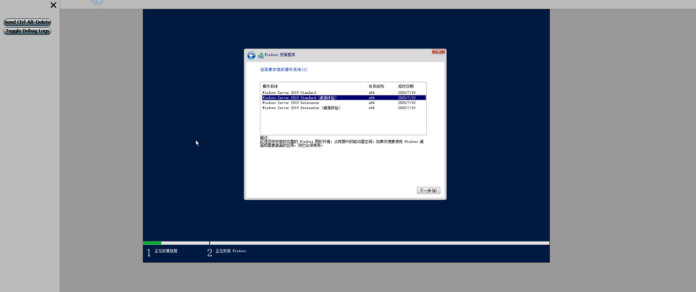
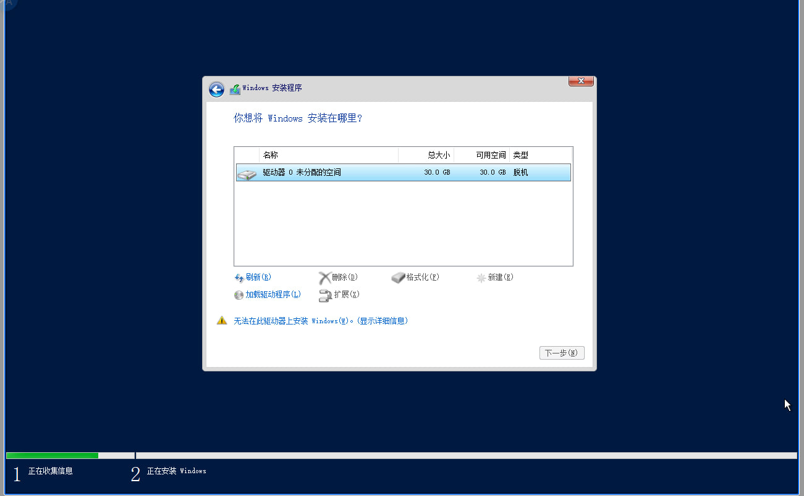
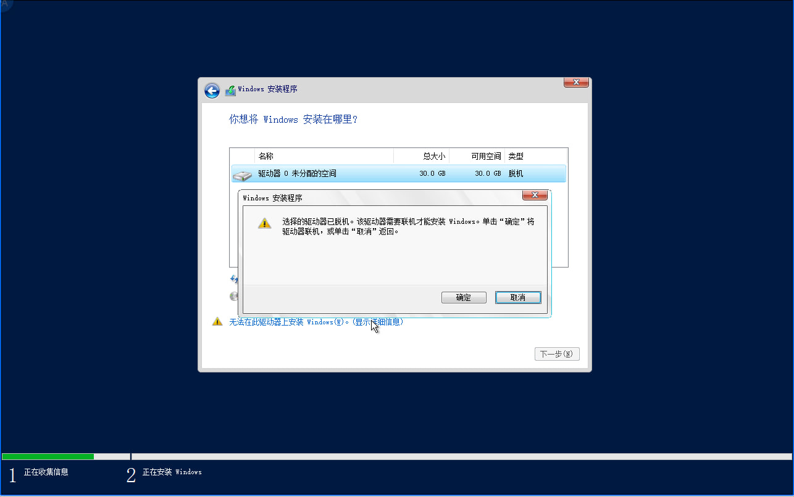
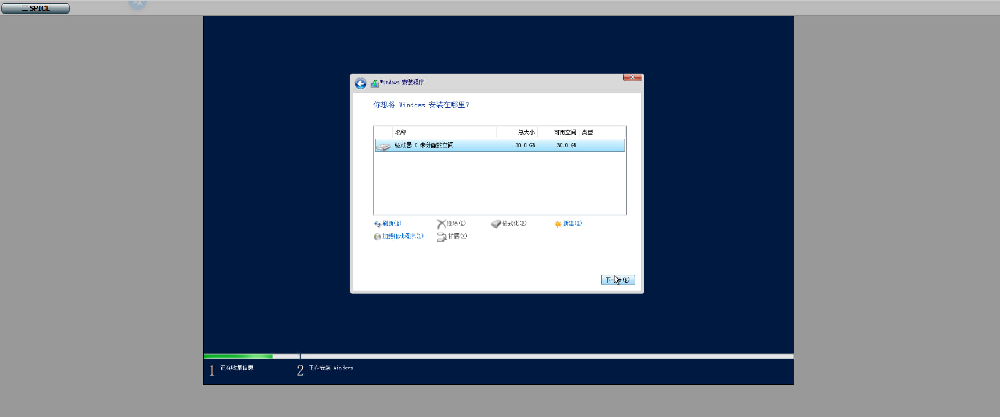

# Running Windows Virtual Machines in LXD

## Verify the LXD Driver

Ensure that `lxc info` output contains `qemu`, otherwise you cannot create VMs:

```shell
lxc info | grep -i driver:
```

If it only shows `lxc`, no need to read the subsequent tutorials, lxd drivers don't support opening a VM.

## Prepare the Environment and Patch the Image

Execute the following commands in sequence in the `/root` directory:

```shell
apt update
apt install -y snapd libguestfs-tools wimtools rsync libhivex-bin libwin-hivex-perl genisoimage || apt install -y mkisofs
snap install lxd-imagebuilder --classic --edge
# reboot to load some config
reboot
```

Download the image and apply the patch. If you're using a different image, replace the download link accordingly.

(You don't need to download the image that comes with virtio, the original image will suffice)

Windows image download link: https://down.idc.wiki/ISOS/Windows/

The following guide will use Windows 2019 as an example:

```shell
wget https://down.idc.wiki/ISOS/Windows/Server%202019/cn_windows_server_2019_updated_july_2020_x64_dvd_2c9b67da.iso -O win.iso
lxd-imagebuilder repack-windows \
  --windows-arch=amd64 \
  win.iso \
  win.lxc.iso
```

The patching time depends on when the program adds the drivers needed for booting (it will add one by one until successful).

Some may take a short time, others may take longer, potentially exceeding 10~30 minutes. It's recommended to run this in `screen` or `tmux`.

After patching is complete, you can delete the original image:

```shell
rm -f win.iso
```

## Create the VM and Mount the Installation ISO

Here I'm using a configuration of 3 CPUs, 5GB RAM, and 30GB storage. If you're using Windows 10 or newer versions, you'll need at least 4 CPUs, 6GB RAM, and 40GB storage.

It's recommended to use more CPU and RAM than the resources I have set up now to avoid the system getting stuck to the point of crashing.

If you don't have enough memory, we recommend checking the Add SWAP item in the Other Useful Items section of this guide to add more virtual memory on your own.

```shell
lxc init winvm --vm --empty
lxc config device override winvm root size=30GiB
lxc config set winvm limits.cpu=3 limits.memory=5GiB
lxc config device add winvm vtpm tpm path=/dev/tpm0
lxc config device add winvm install disk source=/root/win.lxd.iso boot.priority=10
```

## Start the VM and Access the Desktop Remotely via Browser

Install the components needed for browser access:

```shell
apt update
apt install -y spice-html5 websockify lsof
```

Start the VM:

```shell
lxc start winvm
```

Start remote access components:

```shell
SERVER_IP=$(hostname -I | awk '{print $1}')
nohup websockify --web /usr/share/spice-html5 6080 --unix-target=/var/snap/lxd/common/lxd/logs/winvm/qemu.spice > /var/log/websockify-winvm.log 2>&1 &
echo "SPICE HTML5 console on http://${SERVER_IP}:6080/spice_auto.html"
```

At the first boot, you'll need to press the `Ctrl+Alt+Delete` button in the upper left corner of the browser page. After restarting, follow the prompts on the default interface. You'll need to wait 5-10 minutes for the ISO to be loaded for the actual installation.

Eventually, the Zabbly icon will appear and spin for at least 2 minutes. Please be patient.


Once the spinning stops, you'll enter the normal Windows VM installation process, similar to PVE operations.




Here the hard disk can not be selected, choose to view the yellow tips in the lower left corner, and then follow the prompts will be offline hard disk online point to confirm the button, you can select the hard disk.







Once the installation is complete, the virtual machine will automatically reboot a few times to update the network, and the web side of spice will show up in the user setup interface, while in the background you can use the ```lxc list``` to see that the network is automatically attached.


After setting up the user to enter the system login page, execute the following command to shut down/exit Windows, then remove the ISO device to ensure that the next boot is from the hard disk, and then start the virtual machine again.

```shell
lxc stop winvm
lxc config device remove winvm install
lxc start winvm
```

The following image can be seen after startup (test visit a website)


No need to configure your own network, lxd will automatically assign IPV4 addresses and connect to the network.

## Remove the remote component to restart the browser mapping

If you need to delete the VM and recreate it due to resource limitations or other reasons, use `pkill -f websockify` to terminate all SPICE signal forwarding, then `lxc delete -f winvm` to forcibly delete the VM.

```shell
lsof -i :6080
```

Check if the PID for the corresponding port still exists to ensure it has completely stopped (if you have signal forwarding for multiple VMs, it's better not to use `pkill` to delete all of them; use `kill -9` to delete the PID for the specific port).

## If it crashes and stops within a few minutes of first startup

Need to add CPU passthrough

```shell
lxc config set winvm raw.qemu -- "-cpu host"
```

Just start the virtual machine again

## Disadvantages

The frontend lacks authentication, so you can't set user passwords.

If you need frontend authentication, you'll need to use `Guacamole` with additional settings to implement it, which won't be covered in detail here.

The VM piece doesn't have some well established interactive panels and adaptations, ```spice``` is too [old](https://docs.redhat.com/en/documentation/red_hat_enterprise_linux/9/html/considerations_in_adopting_rhel_9/index) (although there is a web-based spice client), and the official panels don't support rbac with a username and password and can only be used with certificates.
