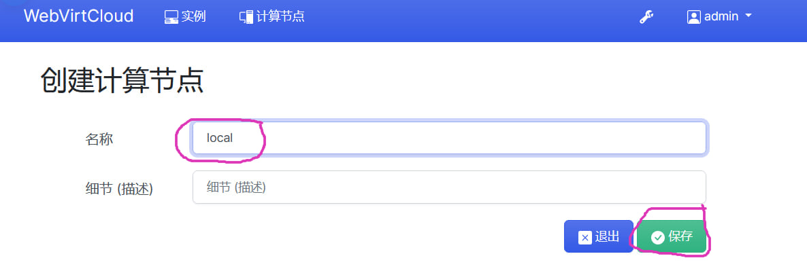
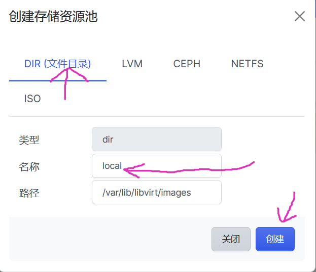
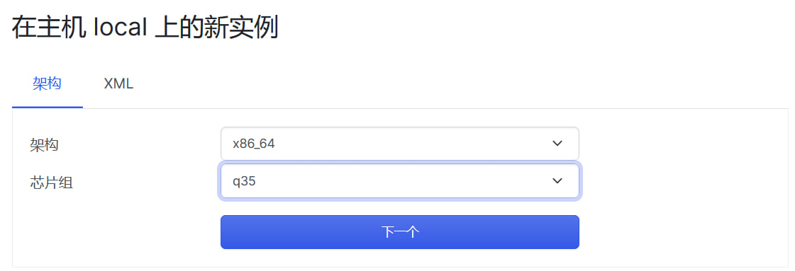
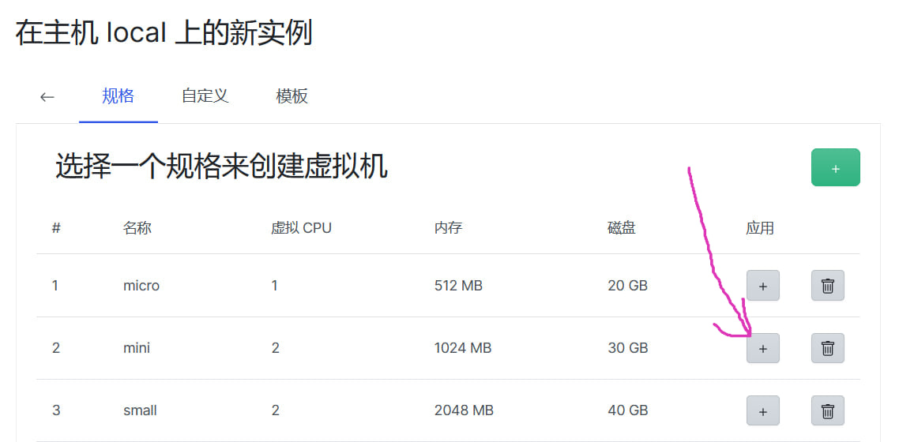
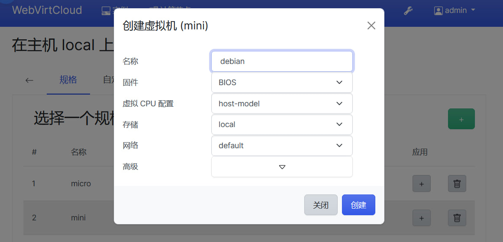
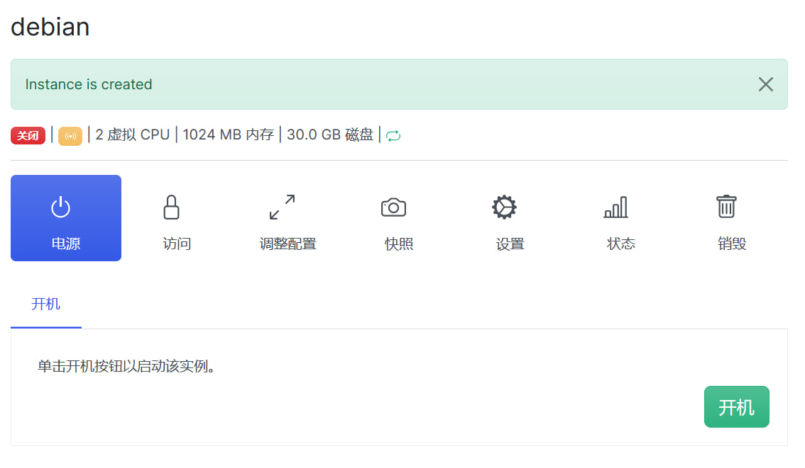
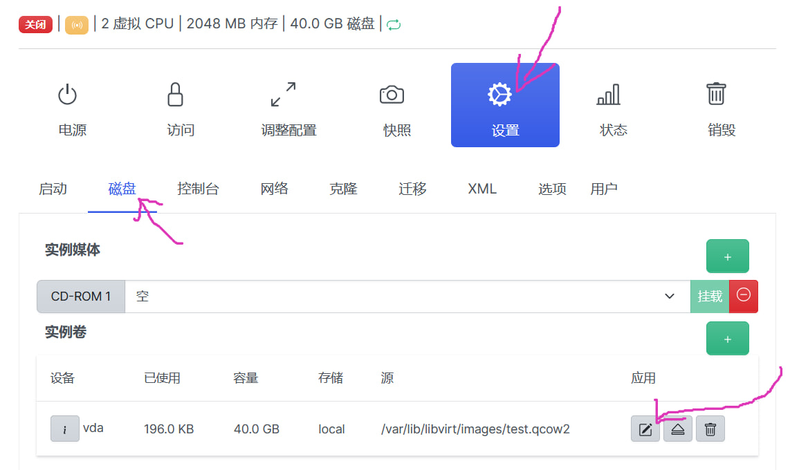
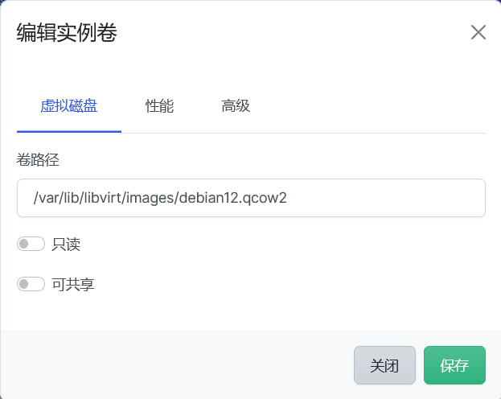
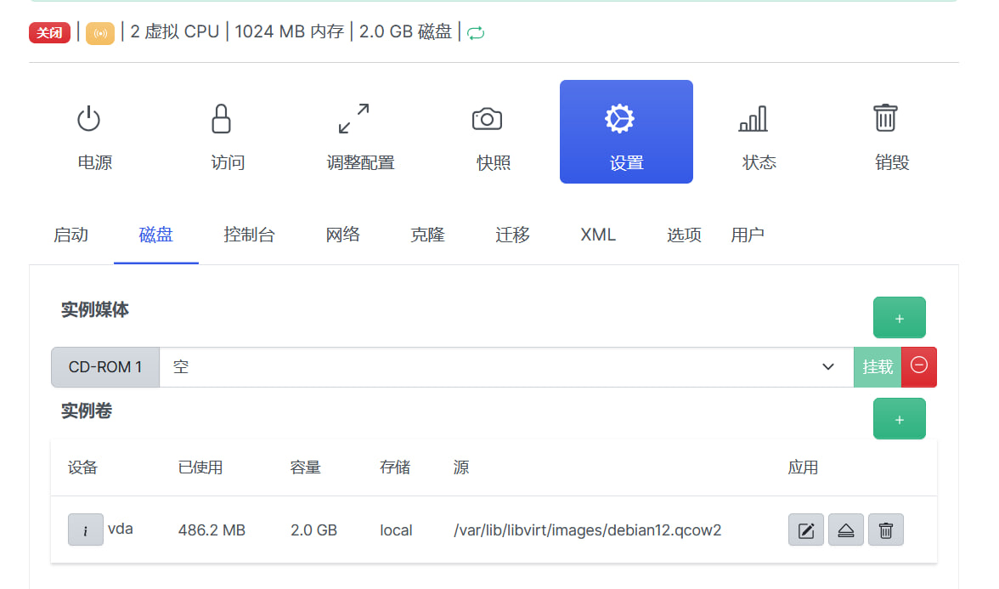

## WebVirtCloud Installation Guide

[](https://hits.spiritlhl.net)

Repository: <https://github.com/oneclickvirt/webvirtcloud>

Origin Repository:：<https://github.com/retspen/webvirtcloud>

## Controller Node and Computer Node Installation

- Supported Systems: Debian10+, Ubuntu18.04+, Centos8+, AlmaLinux8+, RockyLinux8+
- Recommended system: Debian12+, Ubuntu22.04+.
- Lower versions of the system will automatically compile the new version of python installation package before deployment, so it is recommended to use a new system without compiling directly installed!

```bash
curl -slk https://raw.githubusercontent.com/oneclickvirt/webvirtcloud/main/scripts/install_webvirt_cloud_retspen.sh -o install_webvirt_cloud_retspen.sh \
&& chmod +x install_webvirt_cloud_retspen.sh \
&& bash install_webvirt_cloud_retspen.sh
```

After installation is complete, open the public IP address to access the login page.

The default login username and password are both `admin`. Make sure to change them after logging in.

## Creating a Linux Virtual Machine

After entering the control panel and changing the admin password, you need to manually configure a compute node.


Select the type as `Local`, and name it `local`.



After creation, click the eye icon to enter the view.


Under the `Storage` section, add a storage entry. Choose the type `Dir` and name it `local`. If you need to use an ISO for system boot, you’ll need to create a storage of type `ISO`. If not, just follow this guide and create only the `Dir` type.




After creation, download the appropriate qcow2 image for the system using the repository below:

https://github.com/oneclickvirt/pve_kvm_images/releases/tag/images

In the example, a Debian 12 qcow2 image is used:

```shell
cd /var/lib/libvirt/images
wget https://github.com/oneclickvirt/pve_kvm_images/releases/download/images/debian12.qcow2
chmod 777 debian12.qcow2
```

Return to the instance page to create a new instance.


Select `local` as the compute node.


The default chipset is fine; changing it is optional.



You can use predefined sizes for the virtual machine or customize it, depending on your preference.



Note: the instance name must not duplicate the system name. For example, you cannot use `debian12` as the instance name in this case.



After successful creation, **do not** power it on immediately.



You need to modify the disk settings first.



Change the disk file to `debian12.qcow2`, which matches the qcow2 image you previously downloaded.



Once confirmed and configured correctly, return to the power page and turn on the VM.



The default login for the image is:

- **Username**: `root`  
- **Password**: `password` or `oneclickvirt`

## Disadvantages

Networking is not auto-configured — not as smart as the previous project — you still need to configure it manually. 
